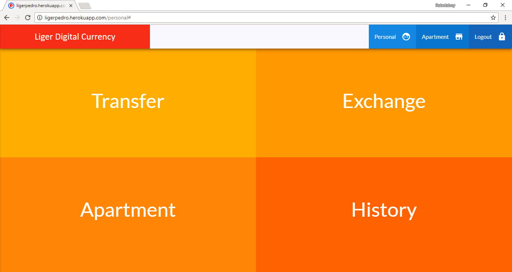
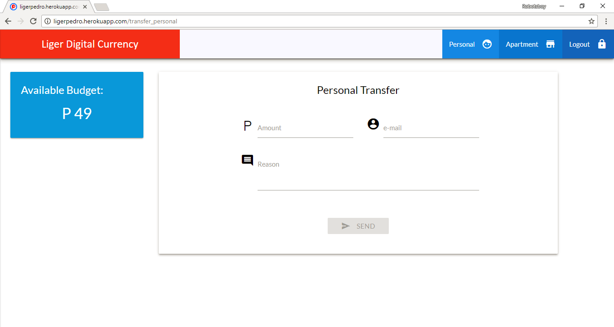
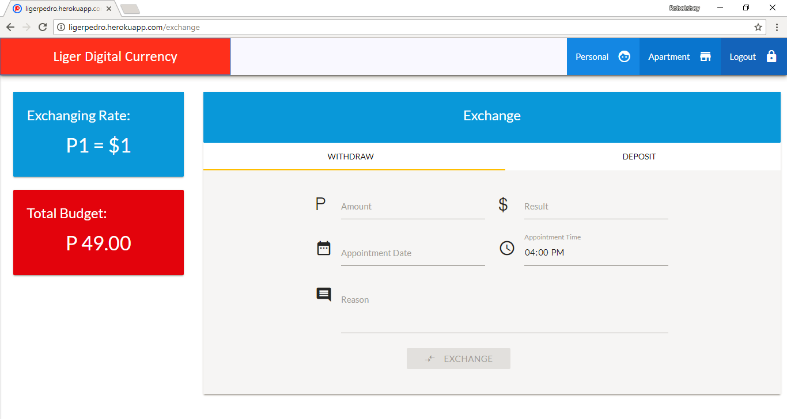
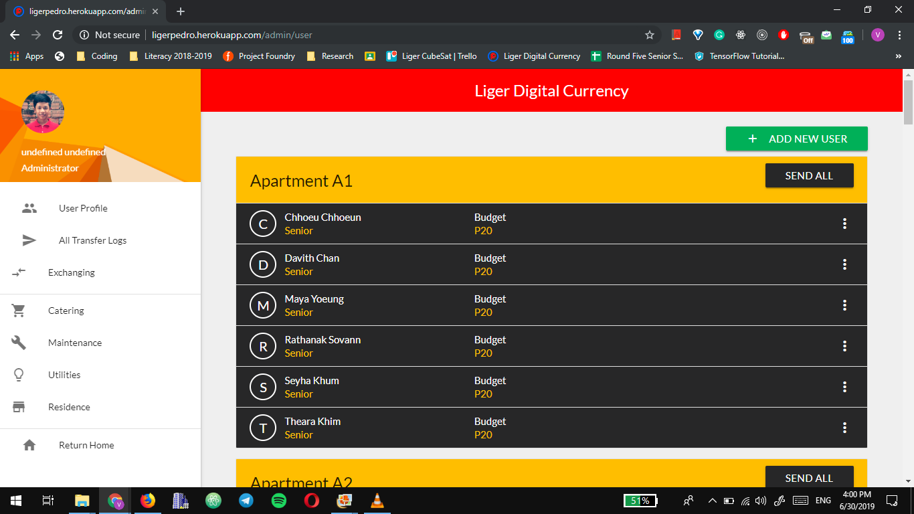

# Pedro


## 📝 Description
Pedro is a digital currency used at the Liger Leadership Academy, a high school in Cambodia. The web app was developed by the students themselves. The name <b>Pedro</b> was inspired by the Napoleon Dynamite movie.

⚠️ **Note:** This project is no longer maintained and may not work with current versions of Node.js and Express.js.

## 🎯 Purpose
The purpose of this project was to teach high school students about financial literacy, to help manage our expenses on necessities and food. Instead of using Riels or Dollars, we used Pedro. It served as a medium for everyday transactions, such as paying for groceries, toiletries, and other essentials. 

## 📸 Screenshots

*Dashboard for Students*


*Pedro Transaction Page*


*Currency Exchange Page*


*Administrator Page - View of Student Statistics*

## 🛠️ Built With
* Express.js
* Handlebars
* PostgreSQL
* Hosted on Heroku

## 🎓 Project Team
### Contributors
- [Vuthy Vey](https://github.com/vvvey) - Fullstack Developer
- [Visal Saosuo](https://github.com/vsaosuo) - Fullstack Developer
- [Malika Chan](https://github.com/5Malika22) - Frontend Developer
- [Sovannou Pich](https://github.com/SovannouPich) - Frontend Developer
- [Ketya Nop](https://github.com/KetyaNop) - Backend Developer
- [Nilroth Ly](https://github.com/NilrothLy) - Backend Developer
- Makara Poy - Frontend Developer
- [Samnang Sineoun](https://github.com/janesmith) - Frontend Developer

### Mentors/Supervisors
* Ali Bucky - Facilitator

## 📊 Results
* Operated for two years with total transactions reaching P10,000
* Students learned to manage their expenses within a limited budget

## 🚀 Setup
```bash
# Clone the repository
git clone git@github.com:vvvey/ligerPedro.git

# Install dependencies
npm install

# Start the server
npm start

